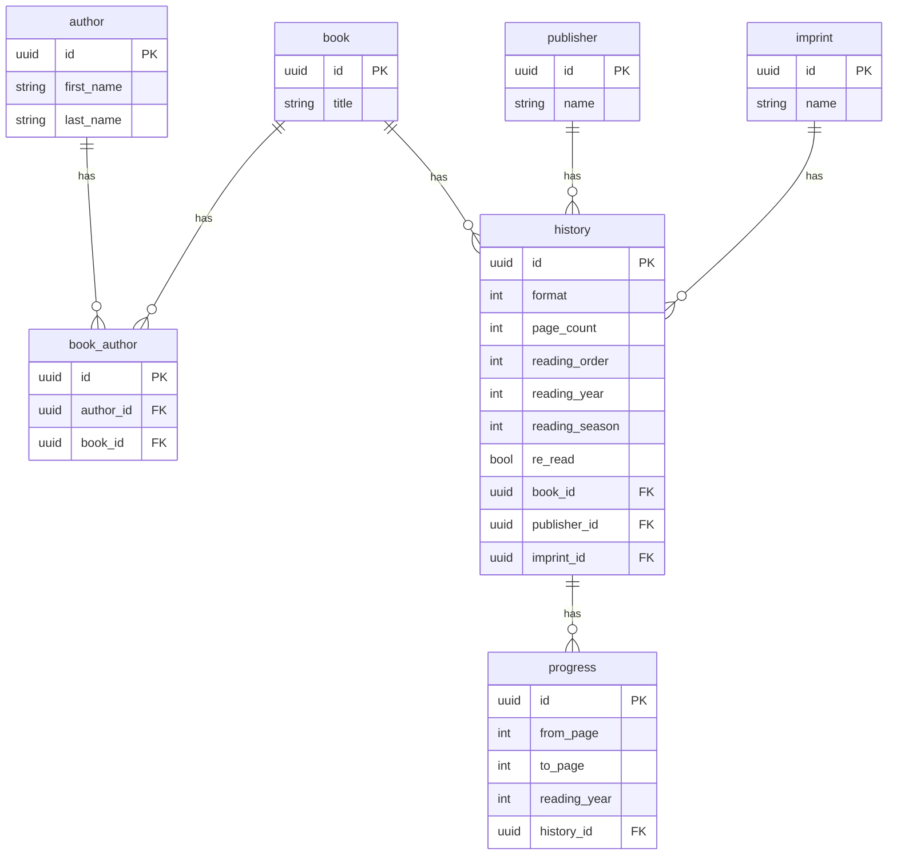

```mermaid
erDiagram

author {
    uuid id PK
    string first_name
    string last_name
}

book {
    uuid id PK
    string title
}

book_author {
    uuid id PK
    uuid author_id FK
    uuid book_id FK
}

history {
    uuid id PK
    int format
    int page_count
    int reading_order
    int reading_year
    int reading_season
    bool re_read
    uuid book_id FK
    uuid publisher_id FK
    uuid imprint_id FK
}

progress {
    uuid id PK
    int from_page
    int to_page
    int reading_year
    uuid history_id FK
}

publisher {
    uuid id PK
    string name
}

imprint {
    uuid id PK
    string name
}

author ||--}o book_author : has
book ||--}o book_author : has
book ||--}o history : has
history ||--}o progress : has
publisher ||--}o history : has
imprint ||--}o history : has
```